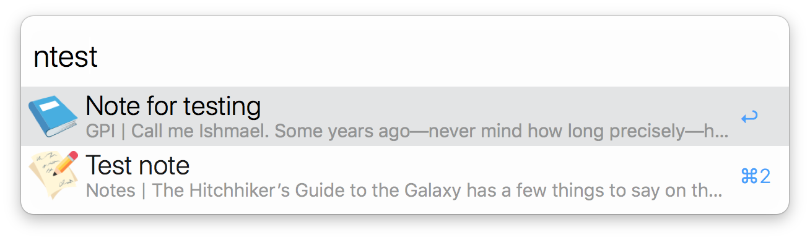

# Search Notes.app with Alfred

  

## Usage

Type `n[part of note title]` and press enter.

## Install

Download the Alfred workflow file from Releases and open it.

## Customize

Icons are from [Emojitwo](https://emojitwo.github.io/) and will show up when they are the first character in the name of a folder, like `📘 GPI` in the screenshot above. Add your own icons to the workflow's `icons` folder and tweak `searchNotes.py` to see them in Alfred.

## Compatibility

The default search method is only tested in High Sierra. If it's not working for you and/or you're on a different version of macOS, try the AppleScript search methods.

  

